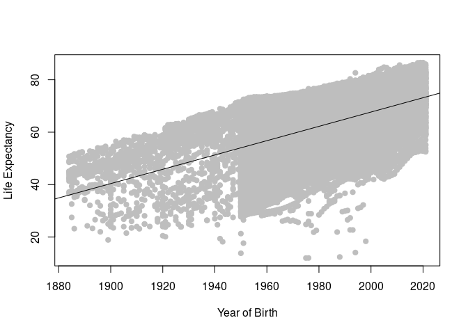
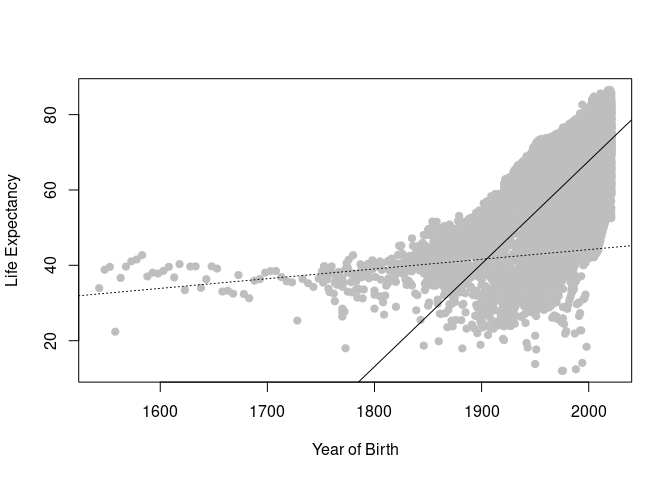

Linear Regression
================
Sydney Drake
2025-10-21

- [Loading the data](#loading-the-data)
  - [(Optional) Sneak Peak For
    Lecture](#optional-sneak-peak-for-lecture)
- [Linear regression: Before 1883, after
  1883](#linear-regression-before-1883-after-1883)
- [Scatterplot with line(s) of best
  fit](#scatterplot-with-lines-of-best-fit)
- [Homework Questions:](#homework-questions)
  - [Q1. How significant is the linear relationship between life
    expectancy and year of
    birth?](#q1-how-significant-is-the-linear-relationship-between-life-expectancy-and-year-of-birth)
  - [Q2. What is the slope of the linear regression line in each
    model?](#q2-what-is-the-slope-of-the-linear-regression-line-in-each-model)
  - [Q3. What might explain changes in the rate of increase in life
    expectancy through the years, especially before and after
    1883?](#q3-what-might-explain-changes-in-the-rate-of-increase-in-life-expectancy-through-the-years-especially-before-and-after-1883)

# Loading the data

``` r
# load data
life_expectancy <- readr::read_csv('https://raw.githubusercontent.com/rfordatascience/tidytuesday/main/data/2023/2023-12-05/life_expectancy.csv')
```

    ## `curl` package not installed, falling back to using `url()`
    ## Rows: 20755 Columns: 4
    ## ── Column specification ────────────────────────────────────────────────────────
    ## Delimiter: ","
    ## chr (2): Entity, Code
    ## dbl (2): Year, LifeExpectancy
    ## 
    ## ℹ Use `spec()` to retrieve the full column specification for this data.
    ## ℹ Specify the column types or set `show_col_types = FALSE` to quiet this message.

## (Optional) Sneak Peak For Lecture

``` r
# Scatterplot with line of best fit
plot(life_expectancy$Year[life_expectancy$Year > 1883],life_expectancy$LifeExpectancy[life_expectancy$Year > 1883], pch = 19, col = "grey", xlab = "Year of Birth", ylab = "Life Expectancy")
abline(lm(LifeExpectancy ~ Year, data = life_expectancy[life_expectancy$Year > 1883,]), lt = 1)
```

<!-- -->

# Linear regression: Before 1883, after 1883

In 1883, Koch identified and isolated the *Vibrio cholerae* bacterium in
pure culture, a discovery previously made by Filippo Pacini in 1854 but
not widely recognized. Koch’s findings provided the definitive
scientific proof needed to firmly establish the germ theory for cholera
and many other diseases and was the beginning of the modern medical era.

``` r
# Linear regression years before 1883 (Koch's germ theory)
lm_b1883 <- lm(LifeExpectancy ~ Year, data = life_expectancy[life_expectancy$Year < 1883,])
summary(lm_b1883)
```

    ## 
    ## Call:
    ## lm(formula = LifeExpectancy ~ Year, data = life_expectancy[life_expectancy$Year < 
    ##     1883, ])
    ## 
    ## Residuals:
    ##     Min      1Q  Median      3Q     Max 
    ## -23.204  -2.009   0.527   2.682  12.073 
    ## 
    ## Coefficients:
    ##              Estimate Std. Error t value Pr(>|t|)    
    ## (Intercept) -7.294260   5.899927  -1.236    0.217    
    ## Year         0.025738   0.003214   8.008 5.33e-15 ***
    ## ---
    ## Signif. codes:  0 '***' 0.001 '**' 0.01 '*' 0.05 '.' 0.1 ' ' 1
    ## 
    ## Residual standard error: 4.979 on 654 degrees of freedom
    ## Multiple R-squared:  0.08931,    Adjusted R-squared:  0.08791 
    ## F-statistic: 64.13 on 1 and 654 DF,  p-value: 5.329e-15

``` r
# Linear regression years after 1883 (Koch's germ theory)
lm_a1883 <- lm(LifeExpectancy ~ Year, data = life_expectancy[life_expectancy$Year > 1883,])
summary(lm_a1883)
```

    ## 
    ## Call:
    ## lm(formula = LifeExpectancy ~ Year, data = life_expectancy[life_expectancy$Year > 
    ##     1883, ])
    ## 
    ## Residuals:
    ##     Min      1Q  Median      3Q     Max 
    ## -52.007  -6.987   2.335   7.901  18.287 
    ## 
    ## Coefficients:
    ##               Estimate Std. Error t value Pr(>|t|)    
    ## (Intercept) -4.781e+02  5.201e+00  -91.93   <2e-16 ***
    ## Year         2.729e-01  2.626e-03  103.92   <2e-16 ***
    ## ---
    ## Signif. codes:  0 '***' 0.001 '**' 0.01 '*' 0.05 '.' 0.1 ' ' 1
    ## 
    ## Residual standard error: 10.05 on 20083 degrees of freedom
    ## Multiple R-squared:  0.3497, Adjusted R-squared:  0.3497 
    ## F-statistic: 1.08e+04 on 1 and 20083 DF,  p-value: < 2.2e-16

# Scatterplot with line(s) of best fit

``` r
plot(life_expectancy$Year,life_expectancy$LifeExpectancy, pch = 19, col = "grey", xlab = "Year of Birth", ylab = "Life Expectancy")
abline(lm_b1883, lt = 3)
abline(lm_a1883, lt = 1)
```

<!-- -->

# Homework Questions:

## Q1. How significant is the linear relationship between life expectancy and year of birth?

- What do the p-values in each model summary tell you about the
  statistical significance of the relationship?

  - The p-values show us the degree of correlation between the two
    factors; in this example, between the year of birth and the life
    expectancy of the individual. In other words, the smaller the
    p-value, the more confident we are that there is statistic
    significance in the relationship between the two values.

- Compare across:

  1)  Before 1883

  - The linear relationship between birth year and life expectancy
    before 1883 was determined to be highly sigificant with a p-value of
    5.33e-15.

  2)  After 1883

  - The linear relationship between birth year and life expectancy after
    1883 is also highly significant with a p-value of 2e-16. This
    p-value is slightly smaller and thereby more significant that the
    p-value for birth years after 1883. Both, however, show a high
    correlation between the two variables.

*Hint: Look at the Pr(\>\|t\|) column for the Year variable in each
summary() output.*

## Q2. What is the slope of the linear regression line in each model?

- Report the estimated slope from the regression output (the coefficient
  for Year).

- Interpret it: How much does life expectancy change per year of birth?

- Compare across:

  1)  Before 1883

  - Before 1883, the slope of the linear regression is determined to be
    0.025738. This means that every year, the life expectancy of
    individuals born in said year was estimated to be higher by 0.025738
    years. This relationship is only significant and reliable before
    1883

  2)  After 1883

  - After 1883, a different linear regression explains the relationship
    between birth year and life expectancy. The slope is determined to
    be 2.729e-01. Interpreted, this means that with each passing year
    after 1883, individuals born in said year were estimated to have a
    life expectancy 2.729e-01 years higher than the previous year. This
    slope is higher than the slope describing the correlation before
    1883 by nearly tenfold, showing a dramatic improvement in life
    expectancy.

*Hint: A higher slope means faster improvement in life expectancy.*

## Q3. What might explain changes in the rate of increase in life expectancy through the years, especially before and after 1883?

While such a trend is affected by many factors, Robert Koch’s discovery
of the bacterium that causes cholera happened in 1883. The
identification and eventually treatment of such a prevalent disease can
greatly decrease fatalities that would otherwise bring the life
expectancy of a population down.

Additionally, in this period, public opinion was rapidly changing and
accepting the idea of germs. With this came an increased emphasis and
attention on cleanliness. This has the potential to dramatically
decrease the prevalence of disease and infection in society, which would
thereby increase the life expectancy of individuals.

You can also refer to insights from the [Our World in
Data](https://ourworldindata.org/life-expectancy?insight=life-expectancy-has-surpassed-predictions-again-and-again#key-insights)
article on the topic.
